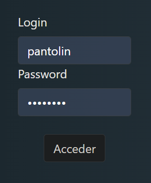
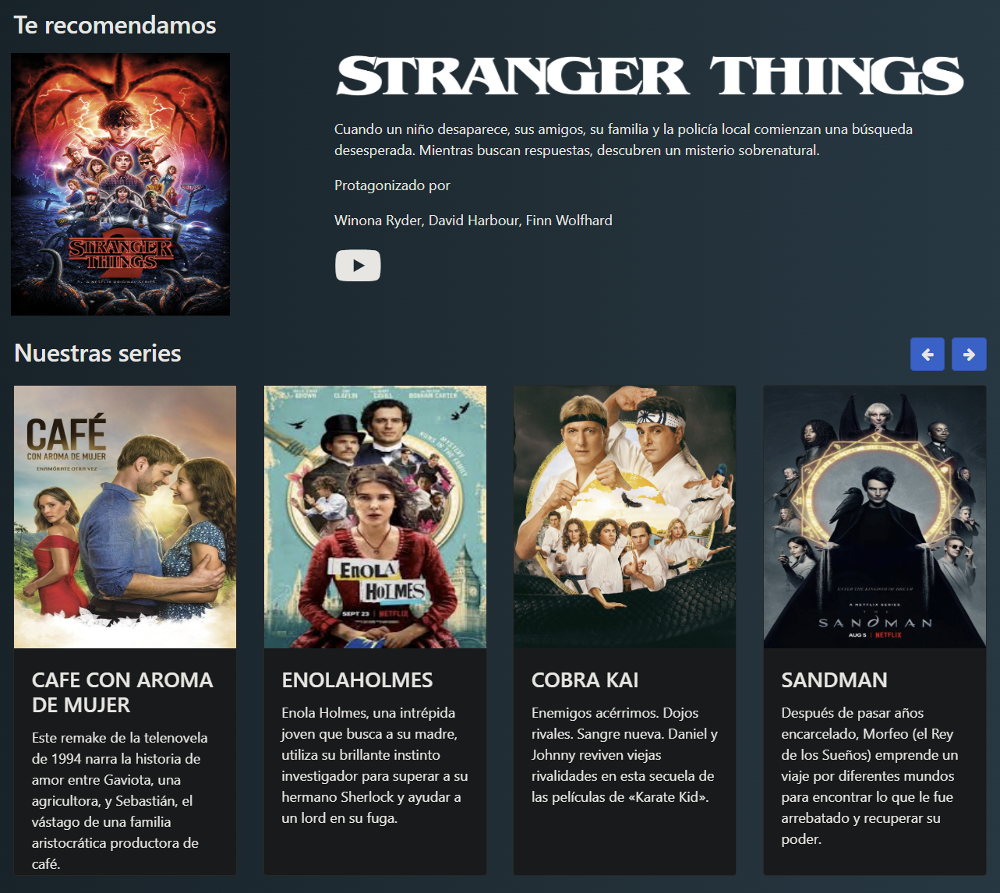
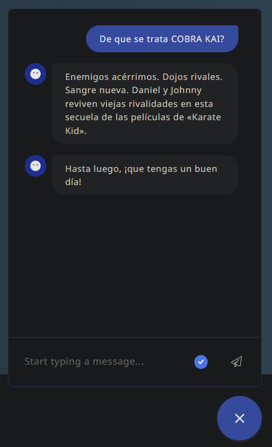
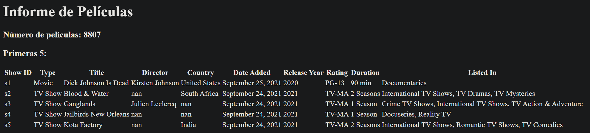
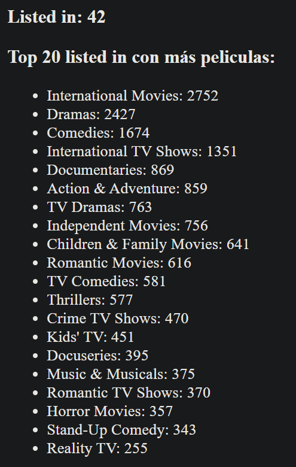
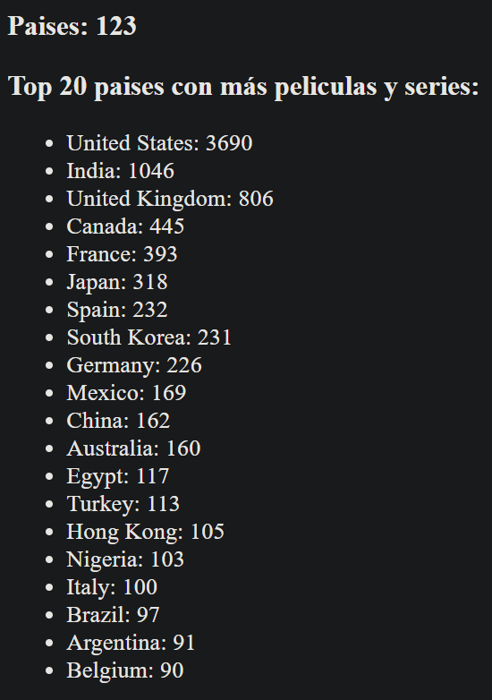
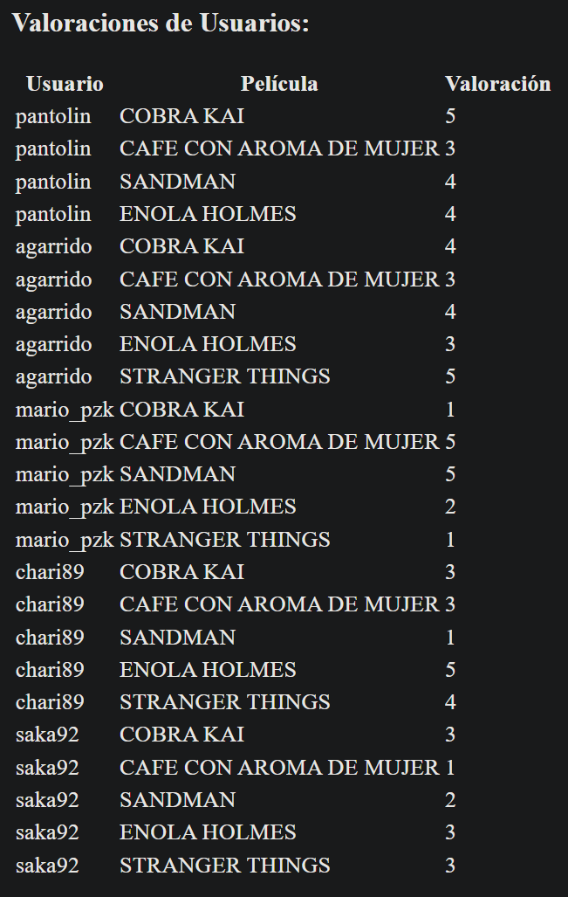
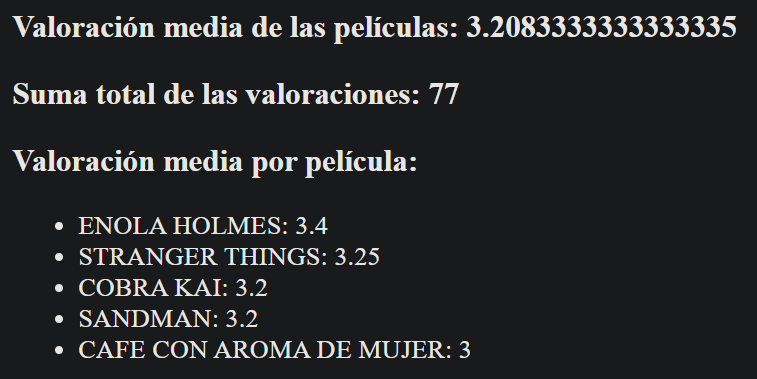

# Práctica M7

Este proyecto es un ejemplo de un recomendador de películas utilizando MongoDB, Rasa y Python. También incluyé un informe de las películas de Netflix y valoraciones.

## Estructura del proyecto

El proyecto contiene los siguientes archivos y carpetas importantes:

- `.devcontainer/`: Carpeta con la configuración del Devcontainer.
- `app/`: Carpeta con el código de la aplicación.
- `app/index.py`: Archivo principal de la aplicación.
- `app/templates/`: Carpeta con las plantillas HTML de la aplicación.
- `app/static/`: Carpeta con los archivos estáticos de la aplicación.
- `app/data/netflix_titles.csv`: Datos de peliculas en netflix.
- `app/asistente/`: Carpeta con el código del asistente virtual Rasa. 
- `app/asistente/data/`: Carpeta con los datos de entrenamiento del asistente.
- `app/asistente/actions/actions.py`: Archivo con las acciones personalizadas del asistente.
- `sprint1/`: Carpeta con el código del sprint 1.
- `data/`: Carpeta con los datos de las películas, usuarios y valoraciones. La applicación utiliza MongoDB para almacenar estos datos, por lo que es necesario tener un servidor de MongoDB en ejecución y tener los datos cargados en la base de datos.

## Requisitos

Para ejecutar este proyecto, recomiendo tener instalado lo siguiente:

- [Docker](https://www.docker.com/)
- [Visual Studio Code](https://code.visualstudio.com/)
- [Visual Studio Code Remote - Containers](https://marketplace.visualstudio.com/items?itemName=ms-vscode-remote.remote-containers)

## Instalación

### Instalación con Devcontainer

1. Clona el repositorio y abre la carpeta del proyecto en VS Code.
2. Asegúrate de tener instalado el Devcontainer y crea y configura un archivo `.env` con las variables necesarias, se incluye un ejemplo `example.env`el cual puedes renombrar a `.env` y modificar según tus necesidades. En si, la unica variable necesaria es `MONGO_CONNECTIONSTRING` la cual es la cadena de conexión a tu base de datos de MongoDB.
3. Selecciona la opción "Reopen in Container" en la parte inferior derecha de VS Code para abrir el proyecto en el Devcontainer.
4. El Devcontainer instalará automáticamente las dependencias necesarias y configurará el ambiente de desarrollo en un contenedor Docker.

#### Instalación manual

En caso de querer instalar las dependencias necesarias manualmente, ejecuta los siguientes comandos en tu ambiente de desarrollo:

```bash
pip install -r requirements.txt
```

También necesitas configurar la variable de entorno MONGO_CONNECTIONSTRING en tu ambiente de desarrollo. Por ejemplo en Linux, puedes hacerlo de la siguiente manera:

```bash
export MONGO_CONNECTIONSTRING="your_mongo_connection_string"
```

### Inicialización de la aplicación

Para inicializar y ejecutar la aplicación, utiliza los siguientes comandos:

```bash
cd app
python index.py
```

### Inicialización de Rasa

Para inicializar y entrenar Rasa, utiliza los siguientes comandos en una nueva terminal para correr las acciones personalizadas:

```bash
cd app/asistente
rasa run actions
```

En otra terminal, ejecuta el siguiente comando para correr el servidor de Rasa:

```bash
cd app/asistente
rasa run -m models --enable-api --cors "*" --debug
```

## Uso

### Acceso a la aplicación

Una vez que la aplicación y el servidor de Rasa estén en ejecución, puedes acceder a la aplicación en tu navegador web en la dirección `http://127.0.0.1:8000`.

### Login 

Para acceder a la aplicación, puedes utilizar las siguientes credenciales en caso de haber cargado los datos de ejemplo:

- Usuario: `pantolin`
- Contraseña: `pantolin`



### Listado de películas y recomendacion

Una vez que hayas iniciado sesión, podrás ver un listado de películas y recibir recomendaciones personalizadas en base a tus valoraciones.

Esta data es cargada desde mongoDB, por lo que es necesario tener los datos cargados en la base de datos. 



### Uso del asistente virtual

En la parte inferior derecha de la pantalla, puedes interactuar con el asistente virtual para recibir recomendaciones de películas y realizar otras consultas.




## Informe

Puedes ingresar al informe del proyecto en la dirección `http://127.0.0.1:8000/informe`.

Aquí encontrarás información sobre las peliculas de Netflix, usuarios y valoraciones.

### Películas de Netflix

Podrás ver el total de películas en el dataset, y algun ejemplo de la data.



Las categorias de las peliculas.



Los paises de origen de las peliculas.



Estos datos se han obtenido con el siguiente código:

```python
def carga_peliculas():
    # carga dataframe de peliculas en data/netflix_titles.csv, la primera fila es el header
    df = pd.read_csv('data/netflix_titles.csv',header=0)
    return df

def get_listed_in(df):
    # obtiene la columna listed_in y la convierte en una lista de strings
    listed_in = df['listed_in'].tolist()
    # devide por comas cada string de la lista y lo convierte en una sola lista con valores unicos
    listed_in = list(set([x.strip() for sublist in [x.split(',') for x in listed_in] for x in sublist]))
    # ordena la lista por mayor cantidad de valores
    listed_in.sort(key=lambda x: len(x), reverse=True)
    return listed_in

def get_listed_in_count(df):
    # obtiene la columna listed_in y la convierte en una lista de strings
    listed_in = df['listed_in'].tolist()
    # devide por comas cada string de la lista y lo convierte en una sola lista
    listed_in = [x.strip() for sublist in [x.split(',') for x in listed_in] for x in sublist]
    # cuenta la cantidad de veces que aparece cada valor en la lista
    listed_in = pd.Series(listed_in).value_counts()
    return listed_in

def get_countries_count(df):
    # obtiene la columna country y la convierte en una lista de strings
    country = df['country'].dropna().tolist()
    # divide por comas cada string de la lista y lo convierte en una sola lista
    country = [x.strip() for sublist in [x.split(',') for x in country] for x in sublist]
    # cuenta la cantidad de veces que aparece cada valor en la lista
    country = pd.Series(country).value_counts()
    return country


```

### Las Valoraciones

Las valoraciones de los usuarios.



Algunos datos de las valoraciones y la media de las valoraciones.



Estos datos se han obtenido con el siguiente código:

```python
def get_valoraciones():
    client = MongoClient (connectionString)
    db = client['filmnet']
    collection = db['usuarios']
    x = collection.find({})
    usuarios = []
    for elem in x:
        usuarios.append(elem['login'])
    collection = db['valoracion']
    filmnet = list(collection.find())
    valoraciones = []
    for elem in filmnet:
        for key, value in elem['valoraciones'].items():
            valoraciones.append([elem['usuario'],key,value])
    return valoraciones

def get_valoracion_media(valoraciones):
    # calcula la media total de todas las valoraciones, devuelve un float
    return statistics.mean([x[2] for x in valoraciones])

def get_valoracion_suma(valoraciones):
    # calcula la suma total de todas las valoraciones, devuelve un int
    return sum([x[2] for x in valoraciones])
 
def get_valoracion_media_peliculas(valoraciones):
    # calcula la media de todas las valoraciones por pelicula, devuelve un diccionario con el nombre de la pelicula y la media
    z = {}
    for elem in valoraciones:
        if elem[1] in z:
            z[elem[1]].append(elem[2])
        else:
            z[elem[1]] = [elem[2]]
    for key, value in z.items():
        z[key] = statistics.mean(value)

    # orderna el diccionario por mayor valor
    z = dict(sorted(z.items(), key=lambda item: item[1], reverse=True))
    return z
```

# ¡Gracias!
